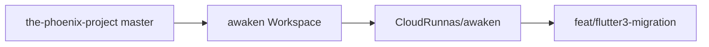
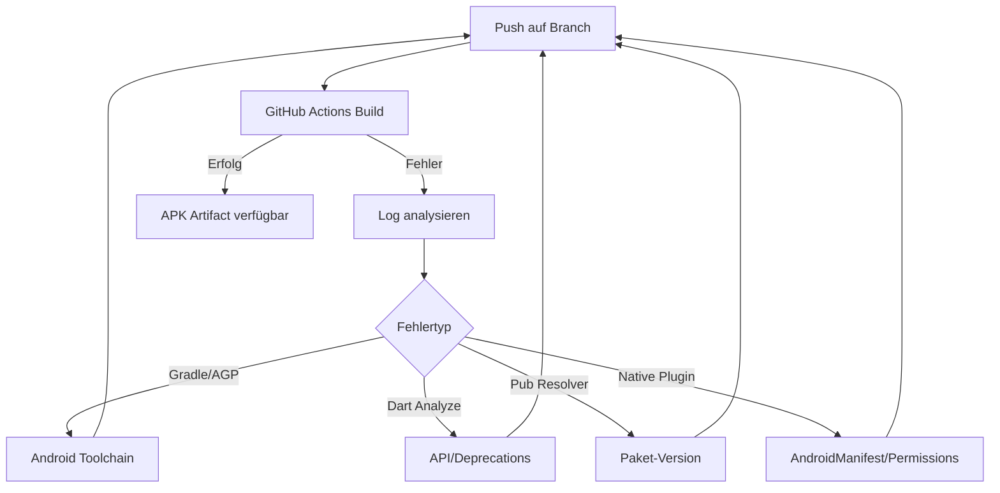

# Flutter-2-zu-3-Migration: The Phoenix Project – Awaken

## Ausgangslage

| Repo | Status |
|------|--------|
| [CloudRunnas/awaken](https://github.com/CloudRunnas/awaken) | Nur `LICENSE`, Remote `origin` bereits konfiguriert |
| [shaan-mephobic/the-phoenix-project](https://github.com/shaan-mephobic/the-phoenix-project) (Branch `master`) | Vollständige Flutter-App, Version `2.4.0+14` |

**Kritische Blocker in der Quelle:**
- SDK-Constraint: `>=2.12.0 <3.0.0` in [`pubspec.yaml`](https://github.com/shaan-mephobic/the-phoenix-project/blob/master/pubspec.yaml)
- Android-Toolchain veraltet: compileSdk 33, AGP 7.1.2, Gradle 7.3.3, imperatives `flutter.gradle`
- 5 discontinued/ersetzte Pakete mit Code-Änderungen nötig
- Keine funktionierenden Tests (`test/widget_test.dart` ist ein auskommentierter Default)
- Paketname bleibt `phoenix` (per deiner Auswahl)

---

## Phase 1: Repository-Setup

1. Phoenix-Quellcode klonen und in `/home/mikedev/Dokumente/awaken` entpacken (bestehende `LICENSE` beibehalten/mergen)
2. Initialen Commit erstellen und nach `origin` (`CloudRunnas/awaken`) pushen
3. Feature-Branch `feat/flutter3-migration` für alle Migrationsänderungen



---

## Phase 2: Analysebasis – pubspec.yaml & Migrationsleitfäden

### Offizielle Migrationsquellen (Reihenfolge)

1. [Flutter Breaking Changes Index](https://docs.flutter.dev/release/breaking-changes) – insbesondere Flutter 3.0, 3.16 (Material 3), 3.44 (Android Kotlin/Gradle)
2. [Flutter 3.0.0 Release Notes](https://docs.flutter.dev/release/release-notes/release-notes-3.0.0) – Null-Safety, Bindings-API
3. [Material 3 Migration](https://docs.flutter.dev/release/breaking-changes/material-3-migration) – **UI bewusst NICHT migrieren**
4. `dart fix --apply` nach SDK-Anhebung

### UI-Erhalt (explizite Vorgabe)

In [`lib/src/beginning/utilities/constants.dart`](https://github.com/shaan-mephobic/the-phoenix-project/blob/master/lib/src/beginning/utilities/constants.dart) `themeOfApp` erweitern:

```dart
ThemeData themeOfApp = ThemeData(
  useMaterial3: false,  // Material-2-Look beibehalten
  // ... bestehende Einstellungen
);
```

Weitere UI-schonende Anpassungen nur bei Compile-Fehlern:
- `Paint.enableDithering = true` in [`lib/main.dart`](https://github.com/shaan-mephobic/the-phoenix-project/blob/master/lib/main.dart) entfernen (deprecated in 3.44)
- `WillPopScope` → `PopScope` (falls vorhanden in `begin.dart`)
- `MaterialStateProperty` → `WidgetStateProperty` (in `constants.dart`)

**Keine** Layout-, Farb- oder Widget-Umstrukturierung.

---

## Phase 3: SDK- und Android-Toolchain-Modernisierung

### pubspec.yaml – SDK

```yaml
environment:
  sdk: '>=3.5.0 <4.0.0'
```

### Android-Migration (Flutter 3.44.1-kompatibel)

Zielwerte basierend auf [Flutter 3.44 Breaking Change: Built-in Kotlin](https://docs.flutter.dev/release/breaking-changes/flutter-gradle-plugin-apply):

| Datei | Aktuell | Ziel |
|-------|---------|------|
| [`android/settings.gradle`](https://github.com/shaan-mephobic/the-phoenix-project/blob/master/android/settings.gradle) | `app_plugin_loader.gradle` | Deklaratives Plugin-Management |
| [`android/build.gradle`](https://github.com/shaan-mephobic/the-phoenix-project/blob/master/android/build.gradle) | AGP 7.1.2, Kotlin 1.6.21, `flutterFFmpegPackage` | AGP 8.7.x, Kotlin 1.9+, FFmpeg-Ext entfernen |
| [`android/app/build.gradle`](https://github.com/shaan-mephobic/the-phoenix-project/blob/master/android/app/build.gradle) | compileSdk 33, imperatives `flutter.gradle` | compileSdk 35, `plugins { id "dev.flutter.flutter-gradle-plugin" }` |
| [`gradle-wrapper.properties`](https://github.com/shaan-mephobic/the-phoenix-project/blob/master/android/gradle/wrapper/gradle-wrapper.properties) | Gradle 7.3.3 | Gradle 8.11.x |
| `AndroidManifest.xml` | `READ/WRITE_EXTERNAL_STORAGE` | `READ_MEDIA_AUDIO` für API 33+ ergänzen |

`flutter create . --platforms=android` als Referenz für fehlende Gradle-Dateien nutzen, bestehende `applicationId` (`com.Phoenix.project`) und Signing-Config beibehalten.

---

## Phase 4: Paket-Migration (Update vs. Ersatz)

### Kategorie A – Ersetzung mit Code-Änderung (hohes Risiko)

| Alt | Neu | Betroffene Dateien | Änderung |
|-----|-----|-------------------|----------|
| `device_info: ^2.0.3` | `device_info_plus: ^11.x` | [`init.dart`](https://github.com/shaan-mephobic/the-phoenix-project/blob/master/lib/src/beginning/utilities/init.dart) | `DeviceInfoPlugin().androidInfo` → gleiche API in Plus-Variante |
| `flutter_ffmpeg: ^0.4.2` | `ffmpeg_kit_flutter_new: ^2.x` | `set_ringtone.dart` | `FlutterFFmpeg().execute(...)` → `FFmpegKit.execute(...)` |
| `on_audio_query: 2.6.1` | `on_audio_query: ^2.9.0` (Fallback: `on_audio_query_forked: ^2.9.1`) | ~13 Dateien | API weitgehend identisch; Permissions/Manifest anpassen |
| `flare_loading: ^3.0.0` (+ `flare_flutter`) | Zuerst kompilieren lassen; bei Fehler: `rive` + `.flr`→`.riv` Konvertierung | [`awakening.dart`](https://github.com/shaan-mephobic/the-phoenix-project/blob/master/lib/src/beginning/widgets/dialogues/awakening.dart) | Nur wenn Build blockiert |
| `awesome_notifications: ^0.6.21` | `awesome_notifications: ^0.10.x` | `visualizer_notification.dart` | Initialisierungs-API anpassen |
| `permission_handler: ^10.0.0` | `permission_handler: ^11.x` | [`init.dart`](https://github.com/shaan-mephobic/the-phoenix-project/blob/master/lib/src/beginning/utilities/init.dart) | `Permission.storage` → `Permission.audio` (API 33+) mit Fallback |

### Kategorie B – Major-Version-Updates (API-kompatibel prüfen)

| Paket | Alt → Neu | Kritische Dateien |
|-------|-----------|-------------------|
| `audio_service` | `^0.18.7` → `^0.18.17` | [`main.dart`](https://github.com/shaan-mephobic/the-phoenix-project/blob/master/lib/main.dart), [`background.dart`](https://github.com/shaan-mephobic/the-phoenix-project/blob/master/lib/src/beginning/utilities/audio_handlers/background.dart) |
| `just_audio` | `^0.9.28` → `^0.10.x` | `background.dart`, `ringtone.dart` |
| `on_audio_edit` | `^1.4.0+1` → neueste kompatible | `edit_song.dart` |
| `share_plus` | `^4.x` → `^10.x` | diverse Pages |
| `image_picker` | `^0.8.x` → `^1.x` | Settings/Artwork |
| `http` | `^0.13.x` → `^1.x` | Scraping-Module |
| `flutter_lints` | `^2.x` → `^5.x` | `analysis_options.yaml` |

### Kategorie C – Minor/Patch-Updates (Resolver-kompatibel)

`another_flushbar`, `another_xlider`, `animated_text_kit`, `page_transition`, `palette_generator`, `sleek_circular_slider`, `sliding_up_panel`, `path_provider`, `provider`, `hive`/`hive_flutter`, `cupertino_icons`, `ionicons`, `material_design_icons_flutter`, `html`, `html_unescape`, `url_launcher`, `screenshot`, `flutter_displaymode`, `flutter_launcher_icons`

### Kategorie D – Git-Dependency

`flutter_remixicon` (Git) – beibehalten, bei Resolver-Fehler auf pub.dev-Fork oder lokales Vendoring prüfen

### Vorgehen pro Paket

```
flutter pub outdated → Version wählen → pub get → Code anpassen → Integrationstest → CI
```

---

## Phase 5: Integrationstests (pro aktualisiertem/ersetztem Paket)

Neue Struktur:

```
integration_test/
├── test_driver/integration_test.dart
└── packages/
    ├── device_info_plus_test.dart
    ├── ffmpeg_kit_test.dart
    ├── on_audio_query_test.dart
    ├── audio_service_test.dart
    ├── just_audio_test.dart
    ├── awesome_notifications_test.dart
    ├── permission_handler_test.dart
    ├── hive_test.dart
    ├── provider_test.dart
    └── ... (je ein Test pro pubspec-Dependency)
```

**Test-Prinzip:** Jeder Test prüft die **konkrete API-Nutzung** aus dem App-Code, nicht generische Pub-Dev-Beispiele.

Beispiel `device_info_plus_test.dart`:
- `DeviceInfoPlugin().androidInfo` aufrufen
- `version.sdkInt > 29` Logik wie in `init.dart` verifizieren

Beispiel `on_audio_query_test.dart`:
- `OnAudioQuery().querySongs(...)` mit gleichen `SongSortType`/`OrderType` Parametern
- Ergebnis-Typ `List<SongModel>` prüfen

**dev_dependencies ergänzen:**
```yaml
dev_dependencies:
  integration_test:
    sdk: flutter
```

**CI-Strategie:**
- Primärziel: APK-Build erfolgreich
- Sekundär: `flutter test integration_test/packages/` auf Android-Emulator (optionaler Job, blockiert APK nicht)
- Lokale Verifikation vor Push: `flutter analyze` + `flutter test`

---

## Phase 6: GitHub Actions Workflow

Basis: [hello_deploy_the_world/.github/workflows/build-apk.yml](https://github.com/CloudRunnas/hello_deploy_the_world/blob/main/.github/workflows/build-apk.yml)

Anpassungen für [`/.github/workflows/build-apk.yml`](.github/workflows/build-apk.yml):

```yaml
name: Build APK

on:
  push:
  workflow_dispatch:

jobs:
  build:
    runs-on: ubuntu-latest
    steps:
      - uses: actions/checkout@v4
      - uses: actions/setup-java@v4
        with:
          distribution: temurin
          java-version: "17"
          cache: gradle
      - uses: subosito/flutter-action@v2
        with:
          channel: stable
          flutter-version: "3.44.1"   # wie gefordert (nicht 3.44.6)
          cache: true
      - run: flutter pub get
      - run: flutter analyze
      - run: flutter build apk --release --build-number=${{ github.run_number }}
      - uses: actions/upload-artifact@v4
        with:
          name: release-apk
          path: build/app/outputs/flutter-apk/app-release.apk
      # Firebase App Distribution Schritt ENTFERNEN
```

Optionaler zweiter Job `integration-tests` mit `reactivecircus/android-emulator-runner` für Paket-Tests.

---

## Phase 7: Iterativer CI-Fix-Loop



Typische erwartete CI-Fehler und Fixes:
1. **Gradle Plugin apply deprecated** → Deklarative Plugins (Phase 3)
2. **Namespace fehlt** in `android/app/build.gradle` → `namespace "com.Phoenix.project"`
3. **FFmpeg native libs** → `ffmpeg_kit_flutter_new` + `flutterFFmpegPackage` entfernen
4. **Permission denied / storage** → `READ_MEDIA_AUDIO` + `Permission.audio`
5. **Registrar not found** (alte Plugins) → Paket-Version oder Fork aktualisieren

Erfolgskriterium: Workflow `Build APK` grün, Artifact `release-apk` enthält `app-release.apk`.

---

## Geschätzter Aufwand nach Risiko

| Bereich | Aufwand | Risiko |
|---------|---------|--------|
| Repo-Clone + Push | 15 min | Niedrig |
| Android Gradle-Migration | 2–4 h | Hoch |
| Audio-Stack (`on_audio_query`, `audio_service`, `just_audio`) | 4–8 h | Sehr hoch |
| FFmpeg Ringtone | 1–2 h | Mittel |
| Übrige Pakete + Tests | 4–6 h | Mittel |
| CI-Iteration | 2–6 h | Hoch |

**Gesamt: ca. 1–2 Arbeitstage**

---

## Wichtige Dateien (Änderungspriorität)

1. [`pubspec.yaml`](pubspec.yaml) – SDK + alle Dependencies
2. [`android/`](android/) – Gradle-Migration
3. [`lib/main.dart`](lib/main.dart) – `enableDithering` entfernen
4. [`lib/src/beginning/utilities/constants.dart`](lib/src/beginning/utilities/constants.dart) – `useMaterial3: false`
5. [`lib/src/beginning/utilities/init.dart`](lib/src/beginning/utilities/init.dart) – Permissions + device_info_plus
6. [`lib/src/beginning/utilities/audio_handlers/background.dart`](lib/src/beginning/utilities/audio_handlers/background.dart) – just_audio/audio_service
7. Ringtone/Notification-Dateien – FFmpeg + awesome_notifications
8. [`.github/workflows/build-apk.yml`](.github/workflows/build-apk.yml) – CI ohne Firebase
