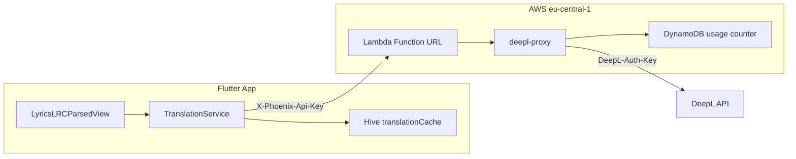

# Lyrics-Übersetzung via DeepL-Lambda-Proxy

## Voraussetzung: Main-Branch

Die Synced-Lyrics-Implementierung liegt auf [`feature/syncedlyrics`](feature/syncedlyrics) (Commit `37440e6`). Vor dem Lambda-Deploy und der UI-Arbeit muss dieser Stand nach **`main` gemergt** werden (idealerweise per Pull Request).

---

## Architektur



**Request-Flow:**
1. App sendet `POST` an Lambda Function URL mit Header `X-Phoenix-Api-Key: <PHOENIX_TRANSLATION_API_KEY>` (Build-Zeit via `--dart-define`, nicht im Quellcode).
2. Lambda prüft App-Key, inkrementiert Tageszähler in DynamoDB (max. **2000/Tag** pro Key), leitet bei Erfolg an DeepL weiter.
3. Antwort: `{ "translations": [{ "text": "..." }], "detected_source_language": "EN" }` (DeepL-Format durchgereicht, vereinfacht).

---

## Phase 1: AWS Lambda + GitHub Workflow

### Neue Infrastruktur im Repo

Ordner: [`infra/deepl-proxy/`](infra/deepl-proxy/)

| Datei | Zweck |
|-------|--------|
| `handler.mjs` | Lambda-Handler: Auth, Rate Limit, DeepL-Forward |
| `package.json` | `@aws-sdk/client-dynamodb`, `@aws-sdk/lib-dynamodb` |
| `deploy.sh` | Idempotentes Deploy via AWS CLI (kein SAM nötig) |

**Lambda-Logik (`handler.mjs`):**
- Env-Vars: `DEEPL_API_KEY`, `PHOENIX_APP_API_KEY` (aus GitHub Secret `PHOENIX_TRANSLATION_API_KEY`), `DEEPL_API_URL`, `DAILY_LIMIT=2000`, `DYNAMODB_TABLE=phoenix-translation-usage`
- Auth: `X-Phoenix-Api-Key` muss exakt `PHOENIX_APP_API_KEY` entsprechen → sonst `401`
- Rate Limit (DynamoDB): PK `apiKey`, SK `date` (UTC), max. 2000/Tag, TTL `expiresAt`
- Body: `{ "text": "string", "target_lang": "DE" }` — optional `source_lang`
- DeepL: `POST /v2/translate` mit `Authorization: DeepL-Auth-Key ${DEEPL_API_KEY}`
- CORS für Flutter

**AWS-Ressourcen (eu-central-1):**
- Lambda: `phoenix-deepl-proxy`, Runtime `nodejs20.x`
- DynamoDB: `phoenix-translation-usage`, PAY_PER_REQUEST
- Function URL: AuthType `NONE` (App-Key in Lambda)

### GitHub Secrets

| Secret | Verwendung |
|--------|------------|
| `DEEPL_API_KEY` | Lambda Env |
| `AWS_ACCESS_KEY_ID` / `AWS_SECRET_ACCESS_KEY` | Deploy |
| `PHOENIX_TRANSLATION_API_KEY` | Neu generieren → Lambda Env + APK `--dart-define` |

Repository Variable: `DEEPL_PROXY_URL` (vom Deploy-Workflow gesetzt)

### Deploy-Workflow

Datei: [`.github/workflows/deploy-deepl-proxy.yml`](.github/workflows/deploy-deepl-proxy.yml)

**Trigger (kein automatischer Push auf `main`):**
- `workflow_dispatch` — manueller Start in GitHub Actions
- `pull_request` (`types: [closed]`, Ziel `main`, nur bei Merge) — Deploy nach PR-Merge

```yaml
on:
  workflow_dispatch:
  pull_request:
    types: [closed]
    branches: [main]
    paths:
      - 'infra/deepl-proxy/**'
      - '.github/workflows/deploy-deepl-proxy.yml'
```

Job-Condition: `workflow_dispatch` **oder** `pull_request.merged == true`

### APK-Build anpassen

In [`build-apk.yml`](.github/workflows/build-apk.yml):

```bash
flutter build apk ... \
  --dart-define=DEEPL_PROXY_URL=${{ vars.DEEPL_PROXY_URL }} \
  --dart-define=PHOENIX_TRANSLATION_API_KEY=${{ secrets.PHOENIX_TRANSLATION_API_KEY }}
```

---

## Phase 2: Flutter — Translation Service

Neue Dateien unter [`lib/src/beginning/utilities/translation/`](lib/src/beginning/utilities/translation/):

- `translation_config.dart`, `deepl_languages.dart`, `translation_service.dart`, `translation_cache.dart`

**Top-20 Zielsprachen:** `DE`, `EN-GB`, `EN-US`, `FR`, `ES`, `IT`, `PT-PT`, `PT-BR`, `NL`, `PL`, `RU`, `JA`, `ZH`, `KO`, `SV`, `DA`, `NB`, `CS`, `HU`, `TR`

Hive-Key: `translationTargetLang` (Default: `DE`)

---

## Phase 3: UI — Gesten + Tooltip

Dependency: `widget_tooltip: ^1.4.0`

| Geste | Aktion |
|-------|--------|
| Tap auf Wort | Wort übersetzen → Tooltip |
| Double-Tap auf Wort | Ganzen Vers übersetzen → Tooltip |
| Long-Press auf Vers | Seek zur LRC-Position |

Widgets: `lyrics_translation_tooltip.dart`, `lyrics_interactive_line.dart` in [`lib/src/beginning/widgets/lyrics/`](lib/src/beginning/widgets/lyrics/)

---

## Phase 4: Einstellungen

Übersetzungs-Sprache in Interface/Settings (`translationTargetLang` in Hive).

---

## Implementierungsreihenfolge

1. Merge `feature/syncedlyrics` → `main` (PR)
2. GitHub Secret `PHOENIX_TRANSLATION_API_KEY` anlegen
3. `infra/deepl-proxy/` implementieren
4. Deploy via **workflow_dispatch** oder PR-Merge nach `main`
5. `build-apk.yml` um `--dart-define` erweitern
6. Flutter TranslationService + UI + Settings

---

## Testplan

| Test | Erwartung |
|------|-----------|
| Lambda Smoke-Test (CI) | `Hello` → `DE` |
| Tap / Double-Tap / Long-Press | Wort / Vers / Seek |
| Rate Limit 2000/Tag | 429 |
| Isolation-Modus | Kein Netzwerk |
