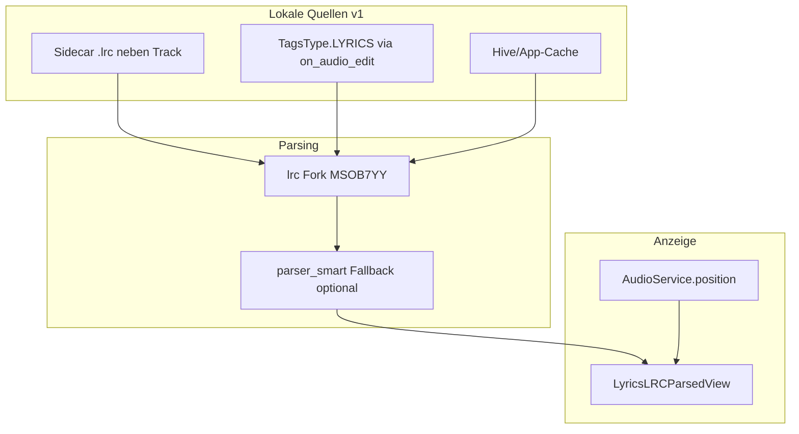

# Synced Lyrics im Phoenix-Musikplayer

## Formate: Was gibt es, was ist populär?

### Eingebettet in Audiodateien

| Format | Container | Tag/Frame | Sync? | Verbreitung |
|--------|-----------|-----------|-------|-------------|
| **USLT** | MP3 (ID3v2) | Unsynchronised Lyrics | Nein (Plaintext) | Sehr häufig |
| **SYLT** | MP3 (ID3v2) | Synchronised Lyrics/Text | Ja (ms pro Zeile) | Selten; wenige Tools (Mp3tag unterstützt es nicht) |
| **LYRICS / UNSYNCEDLYRICS** | FLAC/OGG (Vorbis) | Vorbis Comment | Meist nein | Häufig für Plaintext |
| **©lyr** | M4A/MP4 | Lyrics-Atom | Meist nein | Apple/iTunes-Ökosystem |
| **LRC in USLT/TXXX** | MP3 | Custom | Ja, wenn LRC-Text im Tag | Gelegentlich (Poweramp, manche Tagging-Tools) |
| **TTML/XML** | M4A, manche Streams | Proprietär | Ja | Seltener in lokalen Sammlungen |

### Externe Sidecar-Dateien (am populärsten)

| Format | Datei | Sync-Ebenen | Verbreitung |
|--------|-------|-------------|-------------|
| **LRC (Standard)** | `song.lrc` neben `song.mp3` | Zeilen-Timestamps `[mm:ss.xx]` | **De-facto-Standard** in Player-Apps (Poweramp, Musicolet, Namida, …) |
| **Enhanced LRC** | `.lrc` | Wort-Sync `<00:12.34>Wort` | Wachsend, v. a. bei Fan-Transkriptionen |
| **Extended LRC** | `.lrc` | Mehrere Sänger (`v1:`, `v2:`) | Nische (Duette) |
| **SRT/ASS** | `.srt` / `.ass` | Untertitel-Format | Eher Video; in Musik-Apps unüblich |

**Praxis-Fazit:** In der Realität dominieren **Sidecar-LRC-Dateien** und **eingebetteter LRC-Text in USLT**. SYLT ist technisch „echt eingebettet“, aber praktisch selten. Phoenix v1 fokussiert daher auf **LRC (Sidecar + eingebettet)**; SYLT/TTML bleiben optional für später.



---

## Paketwahl (pub.dev / bestehende Deps)

### Neu hinzufügen

| Paket | Quelle | Begründung |
|-------|--------|------------|
| **`lrc`** | Git: [`MSOB7YY/dart_lrc`](https://github.com/MSOB7YY/dart_lrc) | Identisch mit Namida; unterstützt Standard/Enhanced/Extended LRC, `forUiDisplay()`, Wort-Parts, TTML-Fallback, UTF-16-LRC-Dateien. **Nicht** die schlanke pub.dev-Version `lrc: ^1.0.2`. |
| **`super_sliver_list`** | pub.dev `^0.4.1` | Von Namidas `LyricsLRCParsedView` für präzises `ListController.jumpToItem` / `animateToItem` beim Auto-Scroll |

Abhängigkeiten des `lrc`-Forks (`charset`, `kana_kit`, `xml`) kommen transitiv mit.

### Bereits in [`pubspec.yaml`](pubspec.yaml) nutzen

- **`on_audio_edit`** — `readSingleAudioTag(path, TagsType.LYRICS)` für eingebettete Lyrics (USLT/FLAC/MP4)
- **`path_provider`** — App-Cache für LRC-Dateien
- **`hive`** — Cache-Metadaten (bestehende `offlineLyrics`-Box erweitern)
- **`html_unescape`** — Plaintext-Fallback (bestehend)
- **`http`** — **nicht in v1**; Interface vorbereiten für spätere LRCLIB-Anbindung

### Bewusst nicht in v1

- `lrc_parser` (ANTLR) — Overkill; Namida nutzt den MSOB7YY-Fork
- `flutter_lyric` — eigene UI; wir portieren Namida-UI stattdessen
- SYLT-Parsing — `on_audio_edit`/jaudiotagger exponiert kein SYLT

---

## Architektur im Phoenix-Code

### 1. Lyrics-Datenmodell & Service-Schicht

Neue Dateien unter `lib/src/beginning/utilities/lyrics/`:

- **`lyrics_state.dart`** — Enum `LyricsMode { none, plain, synced }`, Modell `CurrentLyrics { Lrc? synced; String? plain; LyricsSource source }`
- **`lyrics_loader.dart`** — Lade-Pipeline (nur lokal, erweiterbar):

  **Priorität (wie Namida, ohne Internet):**
  1. Sidecar `.lrc` neben Track (Kandidaten: gleicher Basename, `.lrc`/`.LRC`, ggf. `artist - title.lrc`)
  2. App-Cache-LRC (`applicationDocumentsDirectory/lyrics/<trackHash>.lrc`)
  3. Eingebetteter Tag via `on_audio_edit` → `content.parseLRC()` (Extension, siehe unten)
  4. Hive-Cache Plaintext (`offlineLyrics`) — bestehendes Verhalten
  5. *(Zukunft)* `LyricsRemoteProvider.fetch()` — leeres Interface, keine Implementierung in v1

- **`lyrics_extensions.dart`** — Port von Namidas `parseLRC()` / `isValidLRC()` ([`lib/core/extensions.dart`](https://github.com/CloudRunnas/namida/blob/main/lib/core/extensions.dart)) inkl. optionalem `LRCParserSmart`-Fallback aus [`lib/packages/lyrics_parser/`](https://github.com/CloudRunnas/namida/tree/main/lib/packages/lyrics_parser) (3 kleine Parser-Dateien, ~200 Zeilen)

- **`lyrics_controller.dart`** — Singleton analog Namida `Lyrics.inst`:
  - `loadForTrack(MediaItem)` bei Track-Wechsel
  - `resetLyrics()` bei Skip
  - Ruft `globalBigNow.rawNotify()` nach Laden (bestehendes Phoenix-Muster)

**Erweiterbarkeit für Online-API (später):**

```dart
abstract class LyricsRemoteProvider {
  Future<RemoteLyricsResult?> fetch(LyricsSearchQuery query);
}
// v1: NoOpLyricsRemoteProvider
// später: LrcLibLyricsProvider implements LyricsRemoteProvider
```

### 2. Integration in bestehenden Lyrics-Flow

Aktueller Einstieg: [`lib/src/beginning/utilities/audio_handlers/previous_play_skip.dart`](lib/src/beginning/utilities/audio_handlers/previous_play_skip.dart)

- `lyricsFoo()` / `holdUpLyrics()` / `lyricsFetch()` refaktorieren:
  - **`lyricsFetch()`** (Google-Scrape) in v1 deaktivieren (Nutzerwunsch: nur lokal); Plaintext aus Tags/Cache behalten
  - Globale `String? lyricsDat` durch `LyricsController.inst.current` ersetzen (Migration schrittweise: `lyricsDat` als Getter auf Plaintext-Fallback)

Position für Sync (bereits vorhanden): [`lib/src/beginning/widgets/seek_bar.dart`](lib/src/beginning/widgets/seek_bar.dart) nutzt `AudioService.position` — die neue UI hört denselben Stream direkt an (kein Provider-Tick pro Frame nötig).

### 3. UI: Port von Namida `LyricsLRCParsedView`

Neue Datei: **`lib/src/beginning/widgets/lyrics/lyrics_lrc_parsed_view.dart`**

Vorlage: [`namida/lib/packages/lyrics_lrc_parsed_view.dart`](https://github.com/CloudRunnas/namida/blob/main/lib/packages/lyrics_lrc_parsed_view.dart)

**Portieren (vollständig laut Nutzerwunsch):**
- Scroll-Liste mit `super_sliver_list` + `ScrollController`
- Zeilen-Highlight anhand `AudioService.position`
- **Wort-Sync** via `LrcLine.parts` / Enhanced-LRC-Rendering
- Leerzeilen-Opacity-Logik bei langen Pausen
- Manueller Scroll → Auto-Scroll pausiert 3s (Pointer-Handler)
- **Vollbild:** Long-Press oder Button → `Navigator.push` mit `isFullScreenView: true`
- Duration-Stretch-Multiplier (`lrc.forUiDisplay(multiplier)`) wenn `[length:]` abweicht

**An Phoenix anpassen (nicht 1:1 kopieren):**
- Namida-Abhängigkeiten entfernen: `Obx`/`Rx` → `StreamBuilder`/`ListenableBuilder` + `setState`
- Styling: Phoenix `Raleway`, `nowColor`/`nowContrast`, `kRounded`, Blur-Hintergrund aus [`now_playing_sky.dart`](lib/src/beginning/pages/now_playing/now_playing_sky.dart)
- Kein YouTube/Miniplayer-Code
- `Player.inst.nowPlayingPosition` → `AudioService.position` Stream

**Einbindung in Now Playing:**

| Datei | Änderung |
|-------|----------|
| [`now_playing.dart`](lib/src/beginning/pages/now_playing/now_playing.dart) | `Text(lyricsDat)` → `LyricsLRCParsedView` wenn `onLyrics && synced`; sonst Plaintext-Scroll |
| [`now_playing_sky.dart`](lib/src/beginning/pages/now_playing/now_playing_sky.dart) | Gleiche Ersetzung an 3 Stellen (Portrait/Landscape-Layouts) |

### 4. Cache & Speicher

Erweiterung der Hive-Struktur in [`previous_play_skip.dart`](lib/src/beginning/utilities/audio_handlers/previous_play_skip.dart):

```dart
// Bestehend: offlineLyrics[path] -> String (plain)
// Neu optional: offlineLyricsMeta[path] -> { "synced": bool, "source": "sidecar|embedded|cache" }
```

Synced LRC zusätzlich als Datei im App-Verzeichnis speichern (robuster als große Strings in Hive). Plaintext-Cache bleibt kompatibel.

### 5. Einstellungen (minimal)

In [`settings_pages/privacy.dart`](lib/src/beginning/pages/settings/settings_pages/privacy.dart) oder `interface.dart`:
- Toggle „Eingebettete Lyrics bevorzugen“ (wie Namida `prioritizeEmbeddedLyrics`)
- Hinweis: „Synced Lyrics werden aus `.lrc`-Dateien oder Tags gelesen“

Isolation-Modus (`musicBox.isolation`) respektiert weiterhin: **kein** Netzwerk; nur lokale Quellen.

---

## Implementierungsreihenfolge

### Phase A — Grundlagen
1. Dependencies in [`pubspec.yaml`](pubspec.yaml): `lrc` (git), `super_sliver_list`
2. `lyrics_extensions.dart` + optional `parser_smart` aus Namida
3. `LyricsLoader` mit Sidecar-Suche + `on_audio_edit` + Cache
4. `LyricsController` + Anbindung an `updateStuffs()` / `lyricsFoo()`

### Phase B — UI
5. `LyricsLRCParsedView` portieren (Kern: Listen-Build, Highlight, Scroll)
6. Wort-Sync-Rendering (Enhanced LRC Parts)
7. Vollbild-Route + Long-Press-Geste
8. Einbindung in `now_playing.dart` + `now_playing_sky.dart`

### Phase C — Feinschliff
9. Plaintext-Fallback wenn Tag kein gültiges LRC ist (`LrcParser.cleanPlainLyrics`)
10. Settings-Toggle + leere Zustände („Keine Lyrics gefunden“)
11. Manueller Test mit: Sidecar-`.lrc`, USLT mit LRC-Inhalt, USLT Plaintext, Enhanced-LRC

---

## Testplan (manuell)

- Track mit `song.lrc` Sidecar → Zeile springt mit Playback, Auto-Scroll aktiv
- Track mit LRC in USLT-Tag (via Kid3/Mp3tag) → synced Anzeige ohne Sidecar
- Track nur mit Plaintext-USLT → statischer Scroll wie bisher
- Track ohne Lyrics → Fehlermeldung, kein Crash
- Seek während Playback → Highlight springt korrekt
- Manueller Scroll → Auto-Scroll pausiert, setzt nach 3s fort
- Long-Press → Vollbild mit gleicher Sync-Logik
- Isolation-Modus an → kein Netzwerk, nur lokale Quellen
- Rotation Portrait/Landscape in `now_playing_sky.dart`

---

## Risiken & Mitigationen

| Risiko | Mitigation |
|--------|------------|
| `on_audio_edit` liefert SYLT nicht | v1 dokumentieren; Sidecar-LRC als Hauptweg |
| USLT enthält Plaintext, kein LRC | `parseLRC()` → null → Plaintext-Fallback |
| Namida-UI ~1200 Zeilen, viele Abhängigkeiten | Schrittweise portieren; nur benötigte Widget-Teile |
| `lrc`-Git-Fork vs. pub.dev | Explizit Git-Dep wie Namida; gleiche API für UI |
| Performance bei `AudioService.position` | Highlight nur bei Zeilenwechsel updaten (wie Namida `_currentIndex`-Check) |

---

## Dateien mit den größten Änderungen

- [`pubspec.yaml`](pubspec.yaml) — neue Dependencies
- [`lib/src/beginning/utilities/lyrics/*`](lib/src/beginning/utilities/lyrics/) — neu
- [`lib/src/beginning/widgets/lyrics/lyrics_lrc_parsed_view.dart`](lib/src/beginning/widgets/lyrics/lyrics_lrc_parsed_view.dart) — neu (Port)
- [`lib/src/beginning/utilities/audio_handlers/previous_play_skip.dart`](lib/src/beginning/utilities/audio_handlers/previous_play_skip.dart) — Loader-Anbindung
- [`lib/src/beginning/pages/now_playing/now_playing.dart`](lib/src/beginning/pages/now_playing/now_playing.dart) — UI-Swap
- [`lib/src/beginning/pages/now_playing/now_playing_sky.dart`](lib/src/beginning/pages/now_playing/now_playing_sky.dart) — UI-Swap
